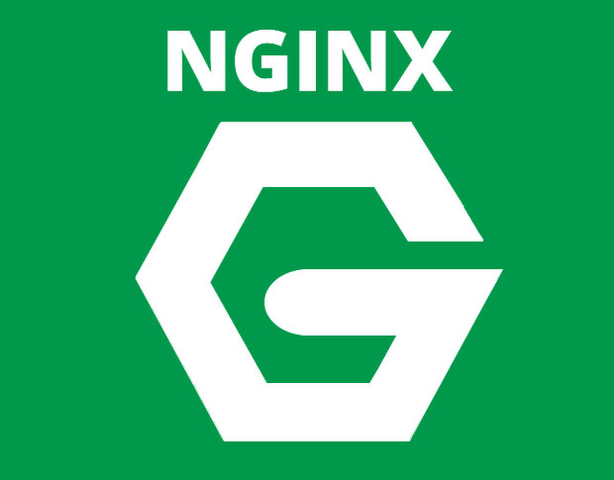
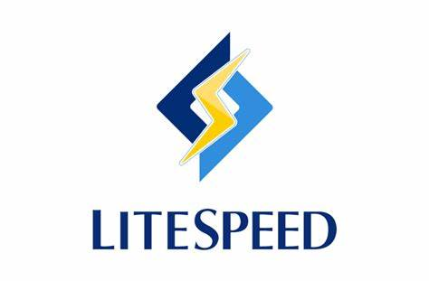

# Tool Evaluation

| **Author** | **Created on** | **Last updated by** |**Version**| **Last edited on** | **Internal Reviewer** | **Reviewer L0** |**Reviewer L1** |**Reviewer L2** |
|------------|----------------|---------------------|-----------|--------------------|---------------|---------------|---------------|---------------|
| Manu Saxena | 10-02-25      | Manu Saxena         | v1 | 10-02-25       | Siddharth | Name |Name |Name |

## Table of Contents
1. [Purpose](#Purpose)
2. [Tools_List](#Tools_List)
3. [Tools Description](#Tools_Description)
4. [Tools List](#Tools_List)
5. [Pre-requirements Table](#Pre-requirements_Table)
6. [Comparison Table](#comparison-table)
7. [Strengths & Weaknesses](#strengths--weaknesses)
8. [Conclusion](#conclusion)
9. [Contacts](#Contacts)
10. [References](#references)

## Purpose
This document evaluates and compares Nginx with its major competitors based on prerequisites, features, performance, strengths, and weaknesses.

## Tools-List
- **Nginx**
- **Apache**
- **Caddy**
- **LiteSpeed**

## Tools Description

***
# Nginx

- A high-performance, lightweight web server and reverse proxy designed for handling multiple concurrent connections efficiently.

 # Apache

- A widely used open-source web server with extensive module support and easy configuration.

 # Caddy

- A modern web server that simplifies HTTPS management with automatic SSL certificate provisioning.  

 # LiteSpeed

- A high-performance web server optimized for speed and efficiency, often used in enterprise and hosting environments.  

## Pre-requirements Table

| **Requirement**        | **Nginx**             | **Apache**            | **Caddy**             | **LiteSpeed**         |
|-----------------------|---------------------|----------------------|----------------------|----------------------|
| **Operating System**  | Linux, Windows, macOS | Linux, Windows, macOS | Linux, Windows, macOS | Linux, Windows, macOS |
| **Installation Method** | Package Manager / Source | Package Manager / Source | Binary / Package Manager | RPM, DEB, Source |
| **Default Port**      | 80 (HTTP), 443 (HTTPS) | 80 (HTTP), 443 (HTTPS) | 80 (HTTP), 443 (HTTPS) | 80 (HTTP), 443 (HTTPS) |
| **Configuration File** | `/etc/nginx/nginx.conf` | `/etc/httpd/httpd.conf` | `/etc/caddy/Caddyfile` | `/usr/local/lsws/conf/httpd_config.conf` |
| **Root Privileges**   | Required | Required | Required | Required |
| **Dependencies**      | OpenSSL, PCRE, zlib | APR, OpenSSL, PCRE | None (Self-contained) | OpenSSL, zlib, PCRE |
| **SSL/TLS Support**  | Manual | Manual | Automatic | Automatic |
| **Minimum RAM/CPU**  | 512MB RAM, 1 vCPU | 1GB RAM, 1 vCPU | 512MB RAM, 1 vCPU | 1GB RAM, 1 vCPU |

## Comparison Table

| Feature               | Nginx                | Apache                | Caddy                 | LiteSpeed            |
|----------------------|---------------------|----------------------|----------------------|----------------------|
| **Performance**      | High, event-driven | Moderate, process/thread-based | High, HTTP/2 optimized | Very High, optimized |
| **Ease of Use**      | Moderate (complex syntax) | Easy (Traditional config) | Very Easy (Simple JSON) | Moderate (GUI + config files) |
| **Resource Usage**   | Low                 | High                 | Low                  | Low                 |
| **Reverse Proxy**    | Yes (Built-in)      | Yes (Via modules)    | Yes (Default)        | Yes (Optimized)     |
| **Load Balancing**   | Yes (Built-in)      | Yes (Via modules)    | Yes (Automatic)      | Yes (Built-in)      |
| **Security**         | High (Rate limiting, WAF) | Moderate (Depends on modules) | High (Auto HTTPS) | High (Built-in WAF) |
| **HTTP/2 & HTTP/3**  | Yes                 | Yes (HTTP/2 only)    | Yes (Default)        | Yes (Optimized)     |
| **Community Support**| Large               | Large                | Growing              | Medium              |
| **License**         | Open-source (FOSS) | Open-source (FOSS)  | Open-source (FOSS)  | Proprietary (Free & Paid) |

## Strengths & Weaknesses
| **Web Server** | **Strengths** | **Weaknesses** |
|---------------|--------------|---------------|
| **Nginx** | High performance and scalability.  Low resource usage.  Built-in reverse proxy and load balancing. | Complex configuration syntax.  Less native support for dynamic content compared to Apache. |
| **Apache** | Extensive module support.  Strong community and documentation. | Higher memory and CPU consumption.  Slower under heavy concurrent load. |
| **Caddy** |  Simple configuration with automatic SSL.  Lightweight and easy to set up. |  Limited ecosystem and support.  Not widely adopted in production environments. |
| **LiteSpeed** |  Fastest PHP performance.  Built-in security features. |  Proprietary licensing.  Limited community support. |

## Conclusion
Nginx is an excellent choice for high-performance web serving and reverse proxying, making it suitable for high-traffic websites. Apache remains a strong option due to its modularity and ease of use. Caddy is ideal for quick deployments with automatic SSL, while LiteSpeed is best for performance-intensive applications, especially in hosting environments. The right choice depends on specific use cases, such as ease of configuration, security, and scalability.

## Contacts

| Name| Email Address      | Contact Number      |
|-----|--------------------------|-----------------|
| Manu Saxena | manu.saxena@mygurukulam.co|9411926902|

## References
| **Reference**                                    | **Description**                                                                  |
|--------------------------------------------------|----------------------------------------------------------------------------------|
| [Nginx Official Docs](https://nginx.org/en/docs/) | Nginx                                   |
| [Apache HTTP Server Docs](https://httpd.apache.org/docs/)   | Apache              |
| [Caddy Documentation](https://caddyserver.com/docs/)    | Caddy          |
| [LiteSpeed Official Site](https://www.litespeedtech.com/)   | LiteSpeed              |
| [Nginx vs Apache vs Caddy vs LiteSpeed Benchmark](https://www.linode.com/docs/guides/nginx-vs-apache-vs-litespeed/)    | All Tools          |
